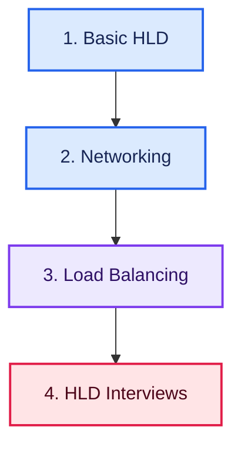

# High Level Design (HLD) Roadmap: From Beginner to Interview-Ready System Design Engineer

> Master High-Level System Design from beginner to advanced — scalability, availability, networking, load balancing, distributed systems, and 50+ real-world interview problems.

## Quick Roadmap

**Foundations:** [Basic HLD](#basic-hld) • [Networking](#networking)

**Core Building Blocks:** [Load Balancing](#load-balancing)

**Practice:** [HLD Interviews](#hld-interviews)

**Career Path:** [Interview Preparation](INTERVIEWS.md) • [Contributing Guide](CONTRIBUTING.md)

## Why Learn High Level Design?

HLD interviews test whether you can take a real product — WhatsApp, Netflix, Uber — and reason about how it should be built at scale: how it stays available, how it handles millions of users, and where it can fail. It's a core round at every senior/product-company interview, and the underlying skills — scalability trade-offs, distributed systems thinking, and capacity estimation — carry directly into building better real-world systems.

## Build Interview-Ready HLD Skills

Go beyond theory and learn how to:

- Reason about availability, scalability, reliability, and the CAP theorem
- Compare consistency models and apply consistent hashing correctly
- Understand core networking: OSI model, TCP vs UDP, HTTP/HTTPS, DNS, proxies
- Design and choose between load balancing algorithms and strategies
- Break down ambiguous prompts into requirements, APIs, data models, and high-level architecture
- Identify and eliminate single points of failure in a design
- Practice with a structured interview-question bank spanning 12+ real-world domains

> **Learn the fundamentals. Reason about trade-offs. Design systems that scale.**

Follow the roadmap in order, starting with HLD fundamentals and networking before moving into load balancing and full interview-style system design problems.

## Complete Learning Path

### Basic HLD

- [Practice](https://tech.examadda.org/system-design-hld/practice)
- [Roadmap](https://tech.examadda.org/system-design-hld/roadmap)
- [Beginner Interview Questions](https://tech.examadda.org/system-design-hld/beginner-interview-questions)
- [Intermediate Interview Questions](https://tech.examadda.org/system-design-hld/intermediate-interview-questions)
- [Advanced Interview Questions](https://tech.examadda.org/system-design-hld/advanced-interview-questions)
- [Scenario-Based Interview Questions](https://tech.examadda.org/system-design-hld/scenario-based-interview-questions)
- [Introduction](https://tech.examadda.org/system-design-hld/hld-basic-introduction)
- [Availability](https://tech.examadda.org/system-design-hld/hld-basic-availability)
- [Scalability](https://tech.examadda.org/system-design-hld/hld-basic-scalability)
- [Reliability](https://tech.examadda.org/system-design-hld/hld-basic-reliability)
- [Latency vs Throughput vs Bandwidth](https://tech.examadda.org/system-design-hld/hld-basic-latency-vs-throughput-vs-bandwidth)
- [CAP Theorem](https://tech.examadda.org/system-design-hld/hld-basic-cap-theorem)
- [Consistency Models](https://tech.examadda.org/system-design-hld/hld-basic-consistency-models)
- [Consistent Hashing](https://tech.examadda.org/system-design-hld/hld-basic-consistency-hashing)
- [Single Point of Failure](https://tech.examadda.org/system-design-hld/hld-basic-single-point-of-failure)

---

### Networking

- [OSI Model](https://tech.examadda.org/system-design-hld/hld-networking-osi-model)
- [IP Address](https://tech.examadda.org/system-design-hld/hld-networking-ip-address)
- [TCP vs UDP](https://tech.examadda.org/system-design-hld/hld-networking-tcp-vs-udp)
- [HTTP/HTTPS](https://tech.examadda.org/system-design-hld/hld-networking-http-https)
- [Domain Name System (DNS)](https://tech.examadda.org/system-design-hld/hld-networking-domain-name-system)
- [Checksums](https://tech.examadda.org/system-design-hld/hld-networking-checksums)
- [Proxy vs Reverse Proxy](https://tech.examadda.org/system-design-hld/hld-networking-proxy-vs-reverse-proxy)

---

### Load Balancing

- [Introductions](https://tech.examadda.org/system-design-hld/hld-load-balancing-introduction)
- [Load Balancing Algorithms](https://tech.examadda.org/system-design-hld/hld-load-balancing-algorithms)
- [DNS Load Balancing](https://tech.examadda.org/system-design-hld/hld-load-balancing-dns)
- [Anycast Routing](https://tech.examadda.org/system-design-hld/hld-load-balancing-anycast-routing)

---

### HLD Interviews

- Basic Questions

  - [URL Shortener](https://tech.examadda.org/system-design-hld/hld-interview-url-shortener)
  - [Design a Rate Limiter](https://tech.examadda.org/system-design-hld/hld-interview-rate-limiter)
  - [Design Pastebin](https://tech.examadda.org/system-design-hld/hld-interview-pastebin)

- Real-Time Communication

  - [Design WhatsApp](https://tech.examadda.org/system-design-hld/hld-interview-whatsapp)
  - [Design Slack](https://tech.examadda.org/system-design-hld/hld-interview-slack)
  - [Design Live Comments](https://tech.examadda.org/system-design-hld/hld-interviews-live-comments)
  - [Design Google Docs](https://tech.examadda.org/system-design-hld/hld-interview-design-google-docs)
  - [Design Zoom](https://tech.examadda.org/system-design-hld/hld-interviews-zoom)

- Social Media Systems

  - [Design Instagram](https://tech.examadda.org/system-design-hld/hld-interview-design-instagram)
  - [Facebook News Feed](https://tech.examadda.org/system-design-hld/hld-interview-facebook-news-feed)
  - [Design TikTok](https://tech.examadda.org/system-design-hld/hld-interviews-tik-tok)
  - [Design Reddit](https://tech.examadda.org/system-design-hld/hld-interview-reddit)
  - [Design Tinder](https://tech.examadda.org/system-design-hld/hld-interviews-tinder-1)
  - [Design Likes Counting System](https://tech.examadda.org/system-design-hld/hld-interview-design-likes-counting-system-1)

- Media Streaming & Delivery

  - [Design Spotify](https://tech.examadda.org/system-design-hld/hld-interviews-design-spotify)
  - [Design YouTube](https://tech.examadda.org/system-design-hld/hld-interviews-design-youtube)
  - [Design Netflix](https://tech.examadda.org/system-design-hld/hld-interviews-design-netflix)
  - [Design Google Drive](https://tech.examadda.org/system-design-hld/hld-interview-design-google-drive)
  - [Design Gmail](https://tech.examadda.org/system-design-hld/hld-interviews-design-gmail)
  - [Design Twitch](https://tech.examadda.org/system-design-hld/hld-interviews-design-twitch)
  - [Location-Based Services](https://tech.examadda.org/system-design-hld/hld-interviews-location-based-services)

- Location-Based Services

  - [Design Airbnb](https://tech.examadda.org/system-design-hld/hld-interview-airbnb)
  - [Design DoorDash/Swiggy](https://tech.examadda.org/system-design-hld/hld-interview-design-doordash-swiggy)
  - [Design Tinder](https://tech.examadda.org/system-design-hld/hld-interviews-tinder)
  - [Design Uber](https://tech.examadda.org/system-design-hld/hld-interviews-uber)
  - [Design Google Maps](https://tech.examadda.org/system-design-hld/hld-interviews-google-maps)

- Search & Aggregation Systems

  - [Search Autocomplete](https://tech.examadda.org/system-design-hld/hld-interview-search-autocomplete)
  - [News Aggregator](https://tech.examadda.org/system-design-hld/hld-interview-news-aggregator)
  - [a Web Crawler](https://tech.examadda.org/system-design-hld/hld-interview-web-crawler)
  - [Google Search](https://tech.examadda.org/system-design-hld/hld-interview-google-search)
  - [Ad Click Aggregator](https://tech.examadda.org/system-design-hld/hld-interview-ad-click-aggregator)

- E-commerce & Marketplace

  - [Design Amazon E-commerce](https://tech.examadda.org/system-design-hld/hld-interviews-design-amazon-e-commerce)
  - [Design Shopify](https://tech.examadda.org/system-design-hld/hld-interview-design-shopify)
  - [Design Airbnb](https://tech.examadda.org/system-design-hld/hld-interview-design-airbnb)
  - [Design Airbnb](https://tech.examadda.org/system-design-hld/design-airbnb)
  - [Design Flash Sale System](https://tech.examadda.org/system-design-hld/hld-interviews-design-flash-sale-system)
  - [Online Auction System](https://tech.examadda.org/system-design-hld/hld-interviews-online-auction-system)
  - [Movie Booking System](https://tech.examadda.org/system-design-hld/hld-interview-movie-booking-system)

- Payment & Financial Systems

  - [Payment System](https://tech.examadda.org/system-design-hld/hld-interviews-payment-system)
  - [Design Digital Wallet](https://tech.examadda.org/system-design-hld/hld-interview-design-digital-wallet)
  - [Design Stock Exchange](https://tech.examadda.org/system-design-hld/hld-interview-design-stock-exchange)

- Distributed Infrastructure

  - [Design Load Balancer](https://tech.examadda.org/system-design-hld/hld-interview-design-load-balancer)
  - [Design API Gateway](https://tech.examadda.org/system-design-hld/hld-interviews-design-api-gateway)
  - [Design a Rate Limiter](https://tech.examadda.org/system-design-hld/design-a-rate-limiter)
  - [Design a Notification System](https://tech.examadda.org/system-design-hld/design-a-notification-system)
  - [Design Key-Value Store](https://tech.examadda.org/system-design-hld/hld-interviews-design-key-value-store)
  - [Design Distributed Cache](https://tech.examadda.org/system-design-hld/hld-interview-design-distributed-cache)
  - [Design a CDN](https://tech.examadda.org/system-design-hld/hld-interviews-cdn)
  - [Design Object Storage (S3)](https://tech.examadda.org/system-design-hld/hld-interview-design-object-storage-s3)
  - [Design Message Queue](https://tech.examadda.org/system-design-hld/hld-interview-design-message-queue)
  - [Time Series Database](https://tech.examadda.org/system-design-hld/hld-interviews-time-series-database)
  - [Distributed Locking Service](https://tech.examadda.org/system-design-hld/hld-interviews-distributed-locking-service)

- Counting & Ranking Systems

  - [Design Likes Counting System](https://tech.examadda.org/system-design-hld/hld-interview-design-likes-counting-system)
  - [Real-time Leaderboard](https://tech.examadda.org/system-design-hld/hld-interview-real-time-leaderboard)
  - [Design Top K System](https://tech.examadda.org/system-design-hld/hld-interview-design-top-k-system)

- Asynchronous Systems

  - [Design a Notification System](https://tech.examadda.org/system-design-hld/hld-interview-notification-system)
  - [Design Job Scheduler](https://tech.examadda.org/system-design-hld/hld-interview-job-scheduler)
  - [Design CI/CD Pipeline](https://tech.examadda.org/system-design-hld/hld-interview-design-ci-cd-pipeline)
  - [Design Monitoring & Alerting System](https://tech.examadda.org/system-design-hld/hld-interview-design-monitoring-alerting-system)

- Specialized Systems

  - [Design LeetCode](https://tech.examadda.org/system-design-hld/hld-interviews-design-leetcode)
  - [Design Calendar System](https://tech.examadda.org/system-design-hld/hld-interview-design-calendar-system)
  - [Design Online Chess](https://tech.examadda.org/system-design-hld/hld-interviews-design-online-chess)

---

## Interview Preparation

Prepare for HLD interviews with level-based questions and practical scenarios.

| Level | Resource |
|:---:|---|
| 🟢 Beginner | [Beginner HLD Interview Questions](https://tech.examadda.org/system-design-hld/beginner-interview-questions) |
| 🟡 Intermediate | [Intermediate HLD Interview Questions](https://tech.examadda.org/system-design-hld/intermediate-interview-questions) |
| 🔴 Advanced | [Advanced HLD Interview Questions](https://tech.examadda.org/system-design-hld/advanced-interview-questions) |
| 🟣 Scenario-Based | [Scenario-Based HLD Interview Questions](https://tech.examadda.org/system-design-hld/scenario-based-interview-questions) |

For structured preparation, follow the complete [HLD Interview Preparation Guide](INTERVIEWS.md).

Focus on clarifying requirements before designing, estimating scale (QPS, storage, bandwidth), justifying trade-offs (SQL vs NoSQL, consistency vs availability), identifying bottlenecks and single points of failure, and being able to extend your design when the interviewer adds new constraints.

## 10-Week Balanced Learning Plan

| Weeks | Learning Focus | Milestone |
|:---:|---|---|
| 1–2 | HLD basics: availability, scalability, reliability, CAP theorem, consistency models | Written trade-off analysis of 2 real systems |
| 3 | Consistent hashing, single points of failure | Design a sharded key-value store on paper |
| 4 | Networking: OSI model, TCP vs UDP, HTTP/HTTPS, DNS, proxies | Networking fundamentals quiz/notes |
| 5 | Load balancing: algorithms, DNS load balancing, anycast routing | Compare 3 load-balancing strategies |
| 6 | Practice: basic & real-time communication systems (URL shortener, rate limiter, WhatsApp) | 2–3 solved HLD problems |
| 7 | Practice: social media & media streaming systems (Instagram, YouTube, Netflix) | 2–3 solved HLD problems |
| 8 | Practice: e-commerce, payments, location-based systems (Amazon, Uber, digital wallet) | 2–3 solved HLD problems |
| 9 | Practice: distributed infrastructure (CDN, message queue, distributed cache) | 2–3 solved HLD problems |
| 10 | Practice: async & specialized systems + capstone and interview revision | Full mock interview + case study write-up |

> Complete each milestone as a documented GitHub write-up (requirements, APIs, data model, architecture diagram) to build an interview-ready portfolio.

## Contributing

Corrections, explanations, test cases and implementations are welcome. Read [CONTRIBUTING.md](CONTRIBUTING.md) before opening a pull request.

## About ExamAdda

[ExamAdda](https://examadda.org) is an all-in-one platform for mastering DSA, system design, development skills, and coding interviews through structured courses, hands-on practice, company-wise questions, and mock interviews.

**Learn smarter. Practice consistently. Crack top tech interviews.**

[Start Learning](https://tech.examadda.org/) • [Explore Courses](https://tech.examadda.org/courses/) • [Unlock ExamAdda Premium](https://examadda.org/premium)

## License

This repository is available under the [MIT License](LICENSE).
